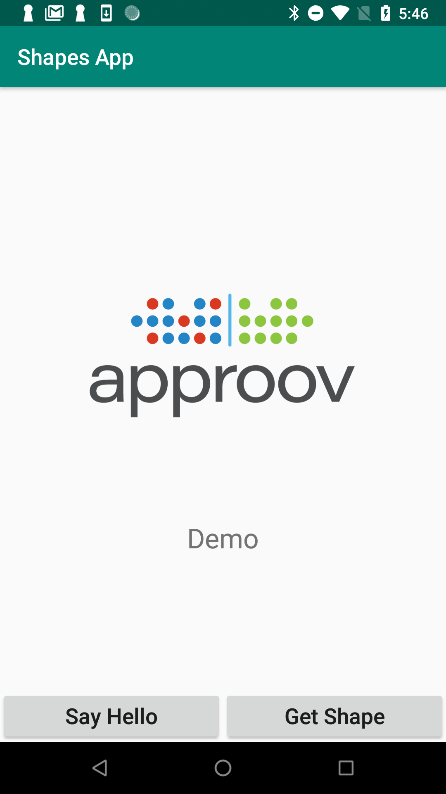
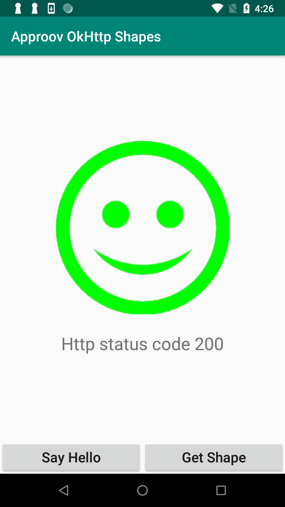
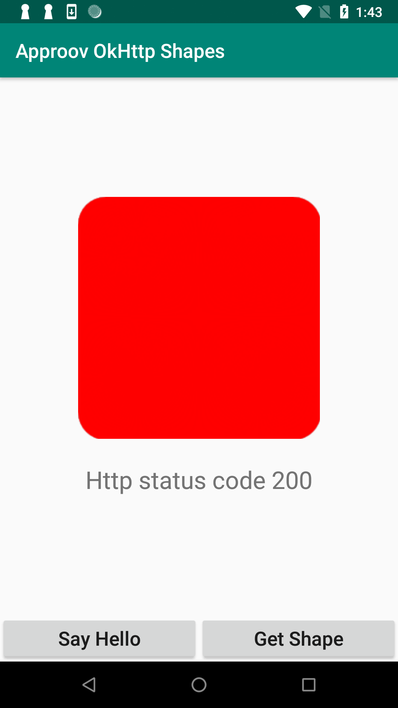

# Shapes Example

This quickstart is written specifically for Android and iOS apps that are implemented using [`Kotlin Multiplatform for Mobile`](https://kotlinlang.org/docs/multiplatform-mobile-getting-started.html) and [`Ktor Client`](https://ktor.io/docs/welcome.html) for network requests. This quickstart provides a detailed step-by-step example of integrating Approov into an app using a simple `Shapes` example that shows a geometric shape based on a request to an API backend that can be protected with Approov.

## WHAT YOU WILL NEED
* Access to a trial or paid Approov account
* The `approov` command line tool [installed](https://approov.io/docs/latest/approov-installation/) with access to your account
* [Android Studio](https://developer.android.com/studio) installed (version Hedgehog 2023.1.1 is used in this guide) if you will build the Android app. Note that the `ANDROID_HOME` value must be properly defined to allow building.
* An installation of Java 11 to support the Gradle plugins used. Note that if this is not globally available then follow the instructions when first trying to build the project to change `JAVA_HOME` or edit `Settings -> Build, Execution, Deployment -> Build Tools -> Gradle` and change the use of the `Gradle JDK` to be a specific version rather than from the `gradle-wrapper.properties` file.
* The [`Kotlin Multiplatform Mobile Plugin`](https://kotlinlang.org/docs/multiplatform-mobile-plugin-releases.html) installed in Android Studio (version 0.8.1 was used in this guide). Amongst other things, this allows iOS apps to be launched directly from Android Studio.
* [Xcode](https://developer.apple.com/xcode/) installed (version 15.1 is used in this guide) to build iOS version of application
* [Cocoapods](https://cocoapods.org) installed to support iOS building (1.12.1 is used in this guide)
* An iOS device or simulator if you are using the iOS platform
* An Android device or emulator if you are using the Android platform
* The content of this repo

## RUNNING THE SHAPES APP WITHOUT APPROOV

Open the folder `shapes-app` folder using `File->Open` in Android Studio. Select the `androidApp` in the `Run/Debug` configuration and then press `Run`. This should launch the app on an Android device or simulator.

You will see two buttons:

<p>
    
</p>

Click on the `Hello` button and you should see this:

<p>
    
</p>

This checks the connectivity by connecting to the endpoint `https://shapes.approov.io/v1/hello`. Now press the `Shape` button and you will see this (or a different shape):

<p>
    
</p>

This contacts `https://shapes.approov.io/v1/shapes` to get the name of a random shape. This endpoint is protected with an API key that is built into the code, and therefore can be easily extracted from the app.

You can run on iOS either by selecting `iosApp` in the Android Studio top menu bar and running (if you have the `KMM` plugin installd in Android Studio) or by opening the `.xcproject` in Xcode and running from there. You will see a very similiar app screen layout in the iOS version.

The subsequent steps of this guide show you how to provide better protection, either using an Approov Token or by migrating the API key to become an Approov managed secret.

## ADD THE APPROOV DEPENDENCY

The addition of Approov requires the SDK and a middleware layer to be added to the project. Both these layers are platform specific and need to be added into the app parts of the project rather than the `shared` part. However, the implementation does allow the `Ktor` calls in the `shared` code to use the appropriate platform specific implementation so that API access code can be common between both platforms. You will need to follow the instructions for both Android and iOS.

## Android

The Approov integration is available via [`maven`](https://mvnrepository.com/repos/central). This allows inclusion into the project by simply specifying a dependency in the `gradle` files for the app. Follow these steps:

1. The dependency to `approov-service-okhttp` needs to be added to the `build.gradle.kts` file in the `shared` project. Uncomment the relevant lines.

2. The dependency to `approov-service-okhttp` also needs to be added to the `build.gradle.kts` file in the `androidApp` project. Uncomment the relevant lines.

Make sure you do a Gradle sync (by selecting `Sync Now` in the banner at the top of the modified `.gradle` file) after making these changes.

Note that `approov-service-okhttp` is actually an open source wrapper layer that allows you to easily use Approov with `OkHttp`. This has a further dependency to the closed source Approov SDK itself.

## iOS

The Approov integration is available via [`CocoaPods`](https://cocoapods.org/). This allows inclusion into the project by simply specifying a dependency in a `Podfile` which should be placed in `iosApp/Podfile`. Create this file if not already present and include this content using an editor:

```
target 'iosApp' do
    use_frameworks!
    platform :ios, '12.0'
    pod 'approov-service-nsurlsession', '~> 3.3.0'
end
```

This includes an open source Approov specialized version of `NSURLSession` and also the closed source [Approov SDK](https://github.com/approov/approov-ios-sdk).

After creating or updating your `Podfile`, change the directory to `iosApp` in your project and type:

```
pod install
```

You can ignore any warnings about `FRAMEWORK_SEARCH_PATHS`.

Note that once the pods have been installed you should open the Xcode project using the generated `iosApp.xcworkspace` as this contains the generated configuration for the pods. 

## ENSURE THE SHAPES API IS ADDED

In order for Approov tokens to be generated or secrets managed for the shapes endpoint, it is necessary to inform Approov about it. Execute the following command:

```
approov api -add shapes.approov.io
```

Note that any Approov tokens for this domain will be automatically signed with the specific secret for this domain, rather than the normal one for your account.

## MODIFY THE SHARED CODE TO USE APPROOV

Shared code, both platform agnostic and specific, needs to be modified to use Approov. Firstly, open `shared/src/commonMain/kotlin/io/approov/shapes/ApplicationApi.kt` and make the commenting changes indicated for the `SHAPES_API_KEY` for Approov usage.

For Android, open `shared/src/androidMain/kotlin/io/approov/shapes/CustomHttpClient.kt` and uncomment the line for the `import` and line to set the `preconfigured` engine.

For iOS, open `shared/src/androidMain/kotlin/io/approov/shapes/CustomHttpClient.kt` and uncomment the lines for the `import` statements, and lines to call the `setPreconfiguredSession` and the lines associated with the `companion object`.

## MODIFY THE APP TO USE APPROOV

You will need to initialize Approov in both the Android and iOS apps. The Approov SDK needs a configuration string to identify the account associated with the app. It will have been provided in the Approov onboarding email (it will be something like `#123456#K/XPlLtfcwnWkzv99Wj5VmAxo4CrU267J1KlQyoz8Qo=`). Copy this to replace the text `<enter-your-config-string-here>`.

## Android

In the file `androidApp/src/main/java/io/approov/shapes/android/MainActivity.kt` uncomment the line that imports `io.approov.service.okhttp.ApproovService` and also the line that calls `ApproovService.initialize`, filling in your actual configuration string.

## iOS

In the file `iosApp/iosApp/ContentView.swift` uncomment the line that imports `approov_service_nsurlsession` and also the the lines that call `ApproovService.initialize` (filling in your actual configuration string) and subsequent lins that setup the session.

### ADD YOUR SIGNING CERTIFICATE TO APPROOV
You should add the signing certificate used to sign apps so that Approov can recognize your app as being official.

Codesigning must also be enabled, if you need assistance please check [Microsoft's codesigning support](https://docs.microsoft.com/en-us/xamarin/ios/deploy-test/provisioning/) or [Android deploy signing](https://docs.microsoft.com/en-us/xamarin/android/deploy-test/signing/?tabs=macos). Make sure you have selected the correct project (Shapes.App.iOS), build mode (Release) and target device (Generic Device) settings.

### Android
Add the local certificate used to sign apps in Android Studio. The following assumes it is in PKCS12 format:

```
approov appsigncert -add ~/.android/debug.keystore -storePassword android -autoReg
```

Note, on Windows you need to substitute \ for / in the above command and the full path specified for the user home directory instead of ~.

See [Android App Signing Certificates](https://approov.io/docs/latest/approov-usage-documentation/#android-app-signing-certificates) if your keystore format is not recognized or if you have any issues adding the certificate. This also provides information about adding certificates for when releasing to the Play Store. Note also that you need to apply specific [Android Obfuscation](https://approov.io/docs/latest/approov-usage-documentation/#android-obfuscation) rules when creating an app release.

### iOS
These are available in your Apple development account portal. Go to the initial screen showing program resources:


Click on `Certificates` and you will be presented with the full list of development and distribution certificates for the account. Click on the certificate being used to sign applications from your particular Xcode installation and you will be presented with the following dialog:


Now click on the `Download` button and a file with a `.cer` extension is downloaded, e.g. `development.cer`. Add it to Approov with:

```
approov appsigncert -add development.cer -autoReg
```

If it is not possible to download the correct certificate from the portal then it is also possible to [add app signing certificates from the app](https://approov.io/docs/latest/approov-usage-documentation/#adding-apple-app-signing-certificates-from-app).

> **IMPORTANT:** Apps built to run on the iOS simulator are not code signed and thus auto-registration does not work for them. In this case you can consider [forcing a device ID to pass](https://approov.io/docs/latest/approov-usage-documentation/#forcing-a-device-id-to-pass) to get a valid attestation.

## SHAPES APP WITH APPROOV API PROTECTION

Run the app again either from Android Studio (either Android or iOS) or run the iOS app from Xcode. Now press the `Shape` button. You should now see this (or another shape):

<p>
    
</p>

This means that the app is obtaining a validly signed Approov token to present to the shapes endpoint.

> **NOTE:** Running the app on an Android emulator or iOS simulator will not provide valid Approov tokens. You will need to ensure it always passes on your the device (see below).

## WHAT IF I DON'T GET SHAPES

If you don't get a valid shape then there are some things you can try. Remember this may be because the device you are using has some characteristics that cause rejection for the currently set [Security Policy](https://approov.io/docs/latest/approov-usage-documentation/#security-policies) on your account:

* Ensure that the version of the app you are running is signed with the correct certificate.
* On Android, look at the [`logcat`](https://developer.android.com/studio/command-line/logcat) output from the device. You can see the specific Approov output using `adb logcat | grep ApproovService`. This will show lines including the loggable form of any tokens obtained by the app. You can easily [check](https://approov.io/docs/latest/approov-usage-documentation/#loggable-tokens) the validity and find out any reason for a failure.
* On iOS, look at the console output from the device using the [Console](https://support.apple.com/en-gb/guide/console/welcome/mac) app from MacOS. This provides console output for a connected simulator or physical device. Select the device and search for `ApproovService` to obtain specific logging related to Approov. This will show lines including the loggable form of any tokens obtained by the app. You can easily [check](https://approov.io/docs/latest/approov-usage-documentation/#loggable-tokens) the validity and find out any reason for a failure.
* Use `approov metrics` to see [Live Metrics](https://approov.io/docs/latest/approov-usage-documentation/#metrics-graphs) of the cause of failure.
* You can use a debugger or emulator/simulator and get valid Approov tokens on a specific device by ensuring you are [forcing a device ID to pass](https://approov.io/docs/latest/approov-usage-documentation/#forcing-a-device-id-to-pass). As a shortcut, you can use the `latest` as discussed so that the `device ID` doesn't need to be extracted from the logs or an Approov token.
* Also, you can use a debugger or Android emulator and get valid Approov tokens on any device if you [mark the signing certificate as being for development](https://approov.io/docs/latest/approov-usage-documentation/#development-app-signing-certificates).

## SHAPES APP WITH SECRETS PROTECTION

This section provides an illustration of an alternative option for Approov protection if you are not able to modify the backend to add an Approov Token check.

Firstly, revert any previous change to `shared/src/commonMain/kotlin/io/approov/shapes/ApplicationApi.kt` for `SHAPES_URL` so that it uses `https://shapes.approov.io/v1/shapes/`, which simply checks for an API key.

Secondly, the `SHAPES_API_KEY` should also be changed to `shapes_api_key_placeholder` by commenting/uncommenting the relevant lines, effectively removing the actual API key out of the code.

We need to inform Approov that it needs to substitute the placeholder value for the real API key on the `api-key` header. This is done separately for each platform:

For Android, in the file `androidApp/src/main/java/io/approov/shapes/android/MainActivity.kt` uncomment the line that calls `Approov.addSubstitutionHeader`.

For iOS, in the file `iosApp/iosApp/ContentView.swift` uncomment the line that calls `Approov.addSubstitutionHeader`.

You must inform Approov that it should map `shapes_api_key_placeholder` to `yXClypapWNHIifHUWmBIyPFAm` (the actual API key) in requests as follows:

```
approov secstrings -addKey shapes_api_key_placeholder -predefinedValue yXClypapWNHIifHUWmBIyPFAm
```

> Note that this command requires an [admin role](https://approov.io/docs/latest/approov-usage-documentation/#account-access-roles).

Run the app again and press the `Shape` button. You should now see this (or another shape):

<p>
    
</p>

This means that the app is able to access the API key, even though it is no longer embedded in the app code, and provide it to the shapes request.
